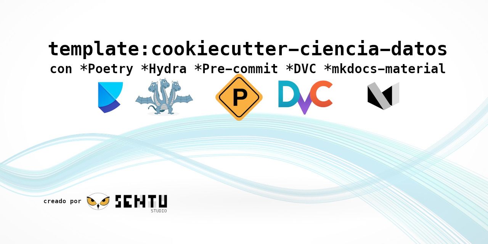

<p align="center">
  <a href="" rel="noopener">
 </a>
</p>
<h3 align="center">Cookie Cutter para Ciencia de Datos e Ingeniería de Datos</h3>

<div align="center">

[](https://sentustudio.github.io/)
[]()
[](https://github.com/SENTUstudio/cookiecutter-ciencia-datos/issues)
[](https://github.com/SENTUstudio/cookiecutter-ciencia-datos/pulls)
[](LICENSE.md)

</div>

📝 Tabla de contenido

- [¿Por qué?](#por-qué)
- [Herramientas usadas en el proyecto](#herramientas-usadas-en-el-proyecto)
- [Estructura del Proyecto](#estructura-del-proyecto)
- [Cómo usar este proyecto](#cómo-usar-este-proyecto)

## ¿Por qué?

Es importante estructurar su proyecto de ciencia de datos en función de un cierto estándar para que sus compañeros de equipo puedan mantener y modificar fácilmente su proyecto.

Este repositorio proporciona una plantilla que incorpora las mejores prácticas para crear un proyecto de ciencia de datos mantenible y reproducible.


## Herramientas usadas en el proyecto
* [Poetry](https://python-poetry.org/): administrador de dependencia
* [Hydra](https://hydra.cc/): administrador de configuración de archivos
* [pre-commit plugins](https://pre-commit.com/): Automatizar el formato de revisión de código
* [DVC](https://dvc.org/): Contro de versión de datos
* [mkdocs-material](https://squidfunk.github.io/mkdocs-material/): Cree automáticamente una documentación API para su proyecto

## Estructura del Proyecto

```bash
.
├── config
│   ├── main.yaml             # Archivo de configuración principal
│   ├── model                 # Configuraciones para el modelo de entrenamiento
│   │   ├── model1.yaml       # Primera variación de los parámetros para entrenar el modelo
│   │   └── model2.yaml       # Segunda variación de los parámetros para entrenar el modelo
│   └── process               # Configuraciones para procesar datos
│       ├── process1.yaml     # Primera variación de los parámetros para procesar datos
│       └── process2.yaml     # Segunda variación de los parámetros para procesar datos
├── data
│   ├── final                 # datos después de entrenar el modelo
│   ├── processed             # datos después del procesamiento
│   ├── raw                   # Datos sin procesar
│   └── raw.dvc               # Archivo dvc de datos/bruto
├── docs                      # Documentación para su proyecto
├── .gitignore                # Ignorar archivos que no pueden comprometerse con GIT
├── Makefile                  # Almacene comandos útiles para configurar el entorno
├── models                    # Modelos de almacenamiento
├── notebooks                 # almacenar notebooks
├── .pre-commit-config.yaml   # Configuraciones para pre-Commit
├── pyproject.toml            # Dependencias para la poetry
├── README.md                 # Describe tu proyecto
├── src                       # almacenar código fuente
│   ├── __init__.py           # Haz de SRC un módulo Python
│   ├── process.py            # Datos de proceso antes del modelo de capacitación
│   └── train_model.py        # modelo de tren
└── tests                     # Pruebas de almacenamiento
    ├── __init__.py           # hacer las pruebas un módulo de python
    ├── test_process.py       # Funciones de prueba para process.py
    └── test_train_model.py   # Funciones de prueba para Train_Model.py
```

## Cómo usar este proyecto

Instalar Cookiecutter:

```shell
pip install cookiecutter
```

Crear un proyecto basado en la plantilla:

```shell
cookiecutter https://github.com/SENTUstudio/cookiecutter-ciencia-datos --checkout main
```
