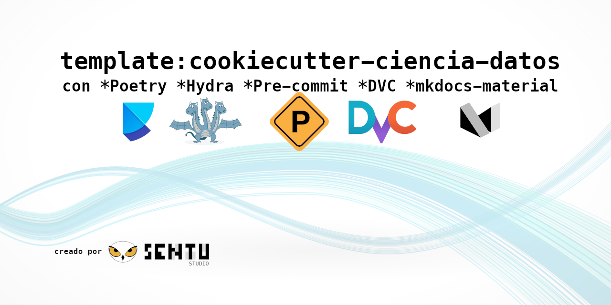
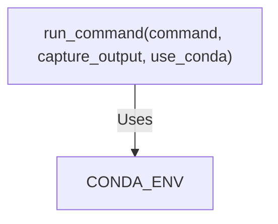
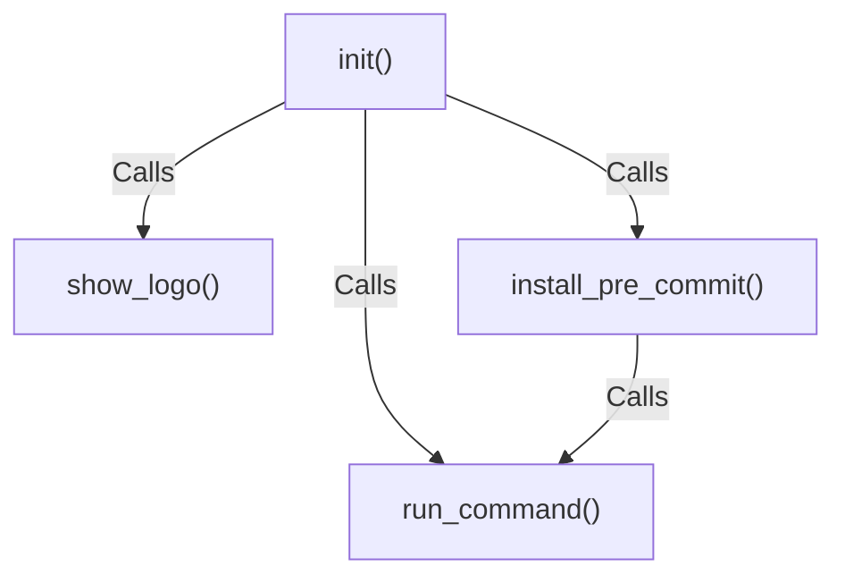
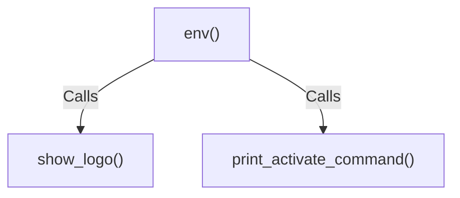
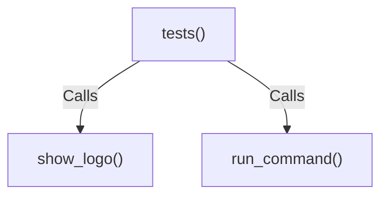
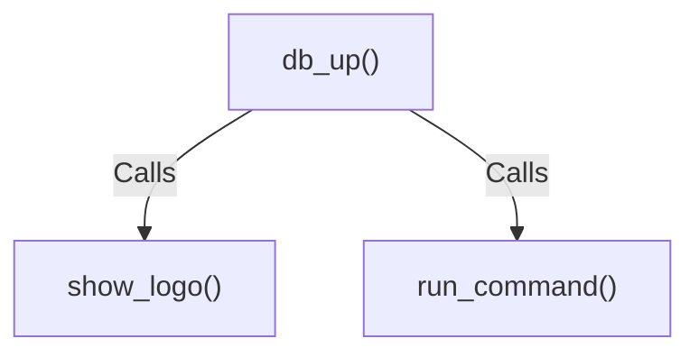
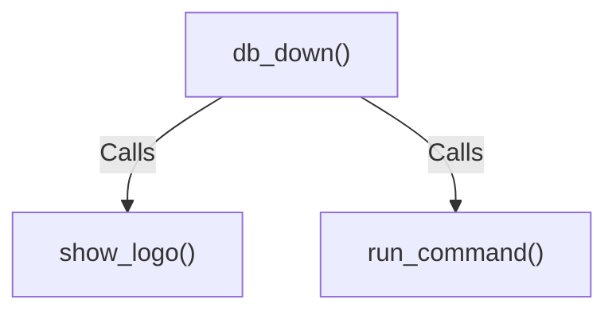
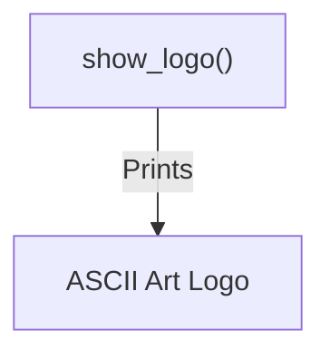
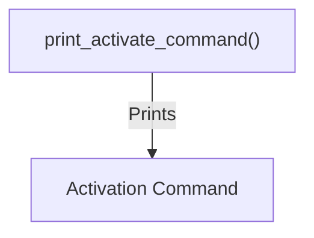

<p align="center">
  <a href="" rel="noopener">
 </a>
</p>
<h3 align="center">Cookie Cutter para Ciencia de Datos e Ingeniería de Datos</h3>

<div align="center">

[](https://sentustudio.github.io/)
[]()
[](https://github.com/SENTUstudio/cookiecutter-ciencia-datos/issues)
[](https://github.com/SENTUstudio/cookiecutter-ciencia-datos/pulls)
[](LICENSE.md)

</div>

>[!WARNING]
>## Why?
>
>It is important to structure your data science project based on a certain standard so that your teammates can easily maintain and modify your project.
>
>This repository provides a template that incorporates best practices for creating a maintainable and reproducible data science project.

## Tools used in the project
* [Poetry](https://python-poetry.org/): Dependency manager
* [Hydra](https://hydra.cc/): File configuration manager
* [pre-commit plugins](https://pre-commit.com/): Automate code review formatting
* [DVC](https://dvc.org/): Data version control
* [mkdocs-material](https://squidfunk.github.io/mkdocs-material/): Automatically create API documentation for your project

## Project Structure

```bash
.
├── config # Project configuration
│   ├── main.yaml # Main configuration file
│   ├── model # Model settings
│   │   ├── model1.yaml # Model 1 configuration
│   │   └── model2.yaml # Model 2 configuration
│   ├── process # Process settings
│   ├── process1.yaml # Process 1 configuration
│   └── process2.yaml # Process 2 configuration
├── data # Project data
│   ├── external # External data
│   ├── final # Final data ready for analysis
│   ├── processed # Processed data
│   ├── raw # Raw unprocessed data
│   └── raw.dvc # DVC file to manage raw data
├── docs # Project documentation
│   ├── assets # Documentation resources
│   │   └── img # Images for documentation
│   └── index.md # Documentation index
├── Makefile # Task automation script
├── mkdocs.yml # MkDocs configuration for documentation
├── models # Trained models
├── notebooks # Jupyter notebooks for analysis and development
├── pyproject.toml # Project configuration in TOML format
├── README.md # README file with the project description
├── references # References and additional resources
├── reports # Reports generated from the analysis
│   └── figures # Figures and graphs from the reports
├── src # Project source code
│   ├── __init__.py # Initialization of the src package
│   ├── process.py # Script for data processing
│   └── train_model.py # Script for training models
└── tests # Testing the source code
├── __init__.py # Initialization from package tests
├── test_process.py # Tests for the processing script
└── test_train_model.py # Tests for the model training script

```

## How to use this project

Install Cookiecutter:

```shell
pip install cookiecutter
```

Create a project based on the template:

```shell
cookiecutter https://github.com/SENTUstudio/cookiecutter-data-science --checkout main
```

# Project CLI Script Documentation

## Overview
This Python script is a command-line interface (CLI) tool for managing various tasks in a data science project. The script leverages the `typer` library to handle command-line arguments, providing an easy-to-use interface for initializing a Git repository, managing a Conda environment, running tests, building documentation, and handling PostgreSQL databases with Docker Compose.

## Dependencies
The script requires the following Python libraries:
- `os`: For interacting with the operating system.
- `subprocess`: For running shell commands.
- `sys`: For handling command-line arguments and system exit codes.
- `typer`: For creating the CLI application.

## Global Variables
- `PROJECT_DIR`: The absolute path to the project directory. This is determined using the `__file__` attribute and `os.path.dirname`.
- `CONDA_ENV`: The path to the Conda environment within the project directory. It is constructed by appending `"env"` to the `PROJECT_DIR` path.

## Functions

### `run_command` Function Documentation


```mermaid
graph TD;
    run_command["run_command(command, capture_output, use_conda)"]
    run_command -->|Uses| CONDA_ENV["CONDA_ENV"]
```

#### Purpose
The `run_command` function is designed to execute shell commands from within a Python script. It provides additional options to capture the output of the command and to run the command within a specified Conda environment.

#### Function Signature

```python
def run_command(command: str, capture_output: bool = False, use_conda: bool = False):
```

#### Parameters

- **`command` (str)**:  
  The shell command to be executed. This should be a valid command string that can be run in a terminal or shell.

- **`capture_output` (bool, optional)**:  
  A flag that indicates whether the function should capture and return the standard output of the command.
  - If `True`, the command's output is captured and returned as a string.
  - If `False`, the output is displayed directly in the terminal, and nothing is returned.
  - Default value: `False`.

- **`use_conda` (bool, optional)**:  
  A flag that determines whether the command should be executed within a Conda environment.
  - If `True`, the command is prefixed with the necessary shell commands to activate the Conda environment specified by the global variable `CONDA_ENV`.
  - If `False`, the command is executed in the current shell environment.
  - Default value: `False`.

#### Returns

- **`str`**:  
  If `capture_output` is `True`, the function returns the captured standard output of the command as a decoded string. If `capture_output` is `False`, the function does not return anything.

#### Exceptions

- **`subprocess.CalledProcessError`**:  
  This exception is raised if the command returns a non-zero exit code (indicating failure). In this case:
  - The function catches the exception.
  - The standard error output of the command (if available) is decoded and printed. If decoding fails or if there is no error output, a generic error message is printed.
  - The function then exits the script with the same return code as the failed command by calling `sys.exit(e.returncode)`.

#### Detailed Behavior

##### 1. **Conda Environment Handling**:
   - If the `use_conda` flag is `True`, the function modifies the `command` string to include the necessary commands for activating the Conda environment.
   - The command is prepended with `eval "$(conda shell.bash hook)" && conda activate "{CONDA_ENV}" &&`, which:
     - Initializes the Conda shell environment.
     - Activates the Conda environment specified by the global variable `CONDA_ENV`.
     - Executes the provided command within this activated environment.

##### 2. **Command Execution**:
   - The command is executed using the `subprocess.run()` function with the following parameters:
     - `shell=True`: Allows the command to be executed in the shell, enabling shell features like pipelines and file redirection.
     - `check=True`: Ensures that a `CalledProcessError` is raised if the command exits with a non-zero status code.
     - `capture_output`: If set to `True`, the command's standard output is captured.
   - If `capture_output` is `True`, the captured output is decoded to a string and returned.

##### 3. **Error Handling**:
   - If the command fails (i.e., returns a non-zero exit code), the function catches the `subprocess.CalledProcessError` exception.
   - The function then attempts to decode and print the command's standard error output (`e.stderr`). If decoding fails or if no error output is available, a generic error message is printed instead.
   - Finally, the script exits with the return code of the failed command to propagate the error status.

#### Example Usage

##### Example 1: Running a Simple Command Without Capturing Output

```python
run_command("ls -l")
```
- This example runs the `ls -l` command, listing the contents of the current directory with details. The output is printed directly to the terminal.

##### Example 2: Running a Command and Capturing Output

```python
output = run_command("echo 'Hello, World!'", capture_output=True)
print(output)  # Output: Hello, World!
```
- This example runs the `echo 'Hello, World!'` command. The output is captured by the function and printed to the console.

##### Example 3: Running a Command in a Conda Environment

```python
run_command("python script.py", use_conda=True)
```
- This example runs `python script.py` within the Conda environment specified by `CONDA_ENV`.

##### Example 4: Handling a Command Failure

```python
run_command("exit 1")
```
- This command forces an exit with a status code of `1`. The function catches the resulting `CalledProcessError`, prints the error message, and exits the script with the same status code.

---

### `install_pre_commit` Function Documentation

#### Purpose
The `install_pre_commit` function is designed to automate the installation of `pre-commit` hooks in a project. `pre-commit` is a framework for managing and maintaining multi-language pre-commit hooks, which are scripts that run automatically before a commit is made in a version control system like Git. This function ensures that the `pre-commit` hooks are installed and activated in the project's Git repository.

#### Function Signature

```python
def install_pre_commit():
```

<details>
<summary>

#### Detailed Description

</summary>

---
##### 1. **Printing Status Message**:
   - The function begins by printing a message to the console: `"Installing pre-commit..."`. This informs the user that the process of installing `pre-commit` hooks is starting.

##### 2. **Running the Installation Command**:
   - The function calls the `run_command` function with the command `"pre-commit install"` to install the pre-commit hooks.
   - The command is executed in the shell, and the `use_conda=True` argument ensures that the command is run within the Conda environment specified by the global variable `CONDA_ENV`.
   - `pre-commit install`:
     - This command sets up the pre-commit hooks for the repository by creating the necessary configuration files and linking the hooks to Git.
     - Once installed, these hooks will automatically run specified checks and validations (e.g., code formatting, linting, security checks) before any commit is made.
---
</details>

#### Example Usage

##### Basic Example

```python
install_pre_commit()
```
- This will install `pre-commit` hooks in the Git repository, ensuring that the predefined checks are enforced every time a commit is made. The function also confirms that the command is run within the active Conda environment.

#### Dependencies

- **`run_command`**:
  - The `install_pre_commit` function relies on the `run_command` function to execute the shell command. It is important that the `run_command` function is correctly defined in the same script or module, as it handles the execution of the shell command and the activation of the Conda environment.

- **`pre-commit`**:
  - The `pre-commit` framework must be available and installed in the project's environment for this function to work. It is typically included as a dependency in the `environment.yml` or `requirements.txt` file of the project.

#### Related Information

- **`pre-commit`**:
  - `pre-commit` is a tool that helps manage and maintain hooks for Git repositories. More information can be found at the official [pre-commit documentation](https://pre-commit.com/).

- **Conda Environment**:
  - The function is designed to run the installation command within a Conda environment. The specific environment is determined by the global `CONDA_ENV` variable, which should point to the environment where `pre-commit` is installed.

> [!NOTE]
>- The `install_pre_commit` function is typically called during the setup or initialization phase of a project to ensure that all necessary hooks are in place from the beginning. This helps maintain code quality and enforce project-specific guidelines throughout the development process.

---
### `init` Function Documentation


```mermaid
graph TD;
    init["init()"]
    init -->|Calls| show_logo["show_logo()"]
    init -->|Calls| run_command["run_command()"]
    init -->|Calls| install_pre_commit["install_pre_commit()"]
    install_pre_commit -->|Calls| run_command
```

#### Purpose
The `init` function is a command-line interface (CLI) command designed to automate the initialization of a new project repository. It performs the following tasks:
1. Initializes a Git repository in the project directory.
2. Renames the default Git branch to `main`.
3. Creates and configures a Conda environment based on the `environment.yml` file.
4. Installs `pre-commit` hooks to enforce code quality standards.

This function is typically used at the beginning of a project to set up the development environment and version control system.

#### Function Signature

```python
@app.command()
def init():
```

##### Decorator

- **`@app.command()`**:
  This decorator is part of the `typer` library and designates the `init` function as a command within a CLI application. Users can invoke this command via the command line, making it an integral part of the project's setup process.

<details>
<summary>

#### Detailed Description

</summary>

---
##### 1. **Displaying the Project Logo**:
   - The function starts by calling `show_logo()`, which displays an ASCII logo or banner representing the project. This provides a visual identifier for the project during the setup process, making it clear to the user that the initialization is starting.

##### 2. **Initializing the Git Repository**:
   - The function prints `"Initializing Git..."` to inform the user that Git initialization is in progress.
   - It then runs the command `git init` using the `run_command` function to initialize a new Git repository in the current project directory.
   - The function also renames the default branch from `master` to `main` by executing `git branch -m main`. This reflects modern Git practices, where `main` is commonly used as the default branch name.

##### 3. **Creating the Conda Environment**:
   - The function prints `"Installing dependencies..."` to indicate the start of the environment setup process.
   - It executes the command `conda env create --prefix {CONDA_ENV} --file environment.yml` using the `run_command` function to create a Conda environment.
     - `--prefix {CONDA_ENV}` specifies the directory where the Conda environment will be created, as defined by the global variable `CONDA_ENV`.
     - `--file environment.yml` tells Conda to use the `environment.yml` file to install the required packages and dependencies.

##### 4. **Installing Pre-commit Hooks**:
   - After the Conda environment is created, the function calls `install_pre_commit()` to set up `pre-commit` hooks. These hooks will automatically run checks (e.g., linting, code formatting) before any commit is made, helping to maintain code quality and consistency throughout the project.
---
</details>

#### Example Usage

To initialize a new project, a user would execute the following command in the terminal:

```bash
python manage.py init
```

- This command will:
  1. Display the project logo.
  2. Initialize a Git repository and rename the default branch to `main`.
  3. Create a Conda environment and install all dependencies listed in `environment.yml`.
  4. Install `pre-commit` hooks.

#### Dependencies

- **`show_logo()`**:
  - Displays the project logo at the beginning of the initialization process. This function must be defined elsewhere in the script or module.

- **`run_command()`**:
  - A utility function that executes shell commands. It is used throughout the `init` function to run Git and Conda commands.

- **`install_pre_commit()`**:
  - Installs `pre-commit` hooks after the Conda environment has been set up. This function must be defined in the same script or module.

- **`CONDA_ENV`**:
  - A global variable that specifies the path to the Conda environment directory. It should be set before this function is called.

#### Related Information

- **Git**:
  - Git is a distributed version control system used to track changes in source code. This function initializes a Git repository, which is essential for managing project versioning.

- **Conda**:
  - Conda is an open-source package management and environment management system. It helps manage project dependencies and environments, ensuring consistency across different development setups.

- **Pre-commit**:
  - `pre-commit` is a framework for managing Git pre-commit hooks. These hooks run checks before code is committed, helping to enforce code quality standards.

>[!NOTE]
>- This function is intended to be part of the initial project setup process. Running it multiple times might result in warnings or errors if the Git repository or Conda environment already exists.
>- The `init` function assumes that the `environment.yml` file is correctly configured and present in the project directory. Any issues with this file (e.g., missing dependencies) will cause the environment setup to fail.

---

### `env` Function Documentation


```mermaid
graph TD;
    env["env()"]
    env -->|Calls| show_logo["show_logo()"]
    env -->|Calls| print_activate_command["print_activate_command()"]

```

#### Purpose
The `env` function is a command-line interface (CLI) command designed to display the necessary command for activating the project's Conda environment. This is particularly useful in guiding users to correctly set up their development environment after the Conda environment has been created.

#### Function Signature

```python
@app.command()
def env():
```

##### Decorator

- **`@app.command()`**:
  This decorator, provided by the `typer` library, marks the `env` function as a command within the CLI application. Users can execute this command from the terminal to get instructions on how to activate the Conda environment.

<details>
<summary>

#### Detailed Description

</summary>

---
##### 1. **Displaying the Project Logo**:
   - The function begins by calling `show_logo()`, which displays an ASCII logo or banner representing the project. This is a visual element that helps users identify the project and provides a consistent user experience when using the CLI.

##### 2. **Printing the Activation Command**:
   - The function then calls `print_activate_command()`, which prints the specific command that the user needs to run in their terminal to activate the Conda environment.
   - This activation command is essential for users to ensure that they are working within the correct Conda environment, which contains all the dependencies and configurations specified for the project.
---
</details>

#### Example Usage

To display the Conda environment activation command, a user would run the following command in the terminal:

```bash
python manage.py env
```

- This command will:
  1. Display the project logo.
  2. Print the command needed to activate the Conda environment, guiding the user on how to proceed with setting up their development environment.

#### Dependencies

- **`show_logo()`**:
  - A function that displays the project logo or banner. It must be defined elsewhere in the script or module. This function is called to provide a consistent and recognizable visual output for the user.

- **`print_activate_command()`**:
  - A function that prints the command necessary to activate the Conda environment. This function must also be defined in the script or module. It is crucial for guiding users on how to activate the Conda environment that contains all the project's dependencies.

#### Related Information

- **Conda**:
  - Conda is an open-source package management and environment management system. It helps manage project dependencies and environments, ensuring consistency across different development setups.

- **Environment Activation**:
  - Activating a Conda environment is a key step in ensuring that the correct dependencies are used when developing or running a project. The environment typically contains all the libraries and tools needed for the project, as specified in an `environment.yml` file.

> [!NOTE]
>- The `env` function does not create or modify the Conda environment; it simply provides instructions on how to activate an existing environment.
>- It is assumed that the user has already created the Conda environment using a command like `conda env create`, and the `CONDA_ENV` variable correctly points to this environment.
>- Running the activation command printed by this function ensures that the user is working within the appropriate environment, which is necessary for avoiding dependency conflicts and ensuring the project runs smoothly.

---
### `tests` Function Documentation


```mermaid
graph TD;
    tests["tests()"]
    tests -->|Calls| show_logo["show_logo()"]
    tests -->|Calls| run_command["run_command()"]
```

#### Purpose
The `tests` function is a command-line interface (CLI) command designed to automate the process of running tests in a project using `pytest`. This function ensures that tests are executed within the correct Conda environment, which contains all the necessary dependencies for the testing process.

#### Function Signature

```python
@app.command()
def tests():
```

##### Decorator

- **`@app.command()`**:  
  This decorator, provided by the `typer` library, registers the `tests` function as a command in the CLI application. Users can invoke this command via the command line to run the project's test suite.

<details>
<summary>

#### Detailed Description

</summary>

---
##### 1. **Displaying the Project Logo**:
   - The function begins by calling `show_logo()`, which displays an ASCII logo or banner representing the project. This provides a consistent and recognizable visual element to the user, indicating that the test execution process is starting.

##### 2. **Printing the Status Message**:
   - The function prints `"Running tests..."` to the console. This message informs the user that the test suite is about to be executed.

##### 3. **Executing the Test Suite**:
   - The function calls `run_command("pytest", use_conda=True)` to execute the `pytest` testing framework within the Conda environment specified by the global variable `CONDA_ENV`.
   - `pytest` is a powerful testing framework for Python that simplifies the process of writing and running tests. It can discover and execute tests automatically based on a set of naming conventions.
   - The `use_conda=True` argument ensures that the `pytest` command is run within the appropriate Conda environment, where all the project's dependencies are installed.
---
</details>

#### Example Usage

To run the project's test suite, a user would execute the following command in the terminal:

```bash
python manage.py tests
```

- This command will:
  1. Display the project logo.
  2. Print a message indicating that the tests are being run.
  3. Execute the `pytest` command within the Conda environment to run the project's test suite.

#### Dependencies

- **`show_logo()`**:
  - A function that displays the project logo or banner. It must be defined elsewhere in the script or module. This function is called at the beginning of the `tests` function to provide a consistent and recognizable visual output for the user.

- **`run_command()`**:
  - A utility function used to execute shell commands. The `run_command` function is responsible for running the `pytest` command within the Conda environment. It must be defined in the same script or module.

- **`pytest`**:
  - `pytest` is a testing framework for Python that allows for easy writing and execution of test cases. The `pytest` command must be available in the Conda environment for the tests to run successfully.

#### Related Information

- **Conda**:
  - Conda is an open-source package management and environment management system. The function uses Conda to ensure that the tests are run in an environment where all dependencies are correctly installed.

- **Pytest**:
  - `pytest` is a widely used testing framework for Python. It simplifies the process of writing and executing tests, supporting various testing needs such as unit testing, functional testing, and more.

> [!NOTE]
>- The `tests` function assumes that the Conda environment is already created and that `pytest` is installed within that environment.
>- Running tests within the correct environment helps to avoid issues related to missing dependencies or version conflicts, ensuring that the tests reflect the true state of the project.
>- This function is typically used as part of a continuous integration (CI) pipeline or during the development process to verify that the code works as expected.

---
### `docs` Function Documentation


```mermaid
graph TD;
    docs["docs()"]
    docs -->|Calls| show_logo["show_logo()"]
    docs -->|Calls| run_command["run_command()"]
```

#### Purpose
The `docs` function is a command-line interface (CLI) command designed to automate the process of building and serving project documentation using MkDocs. MkDocs is a static site generator that's geared towards creating project documentation, making it easy to write and maintain documentation in Markdown. This function ensures that the documentation is built and served within the correct Conda environment, where all dependencies are properly managed.

#### Function Signature

```python
@app.command()
def docs():
```

##### Decorator

- **`@app.command()`**:  
  This decorator, provided by the `typer` library, registers the `docs` function as a command within the CLI application. Users can run this command from the terminal to build and serve the project's documentation.

<details>
<summary>

#### Detailed Description

</summary>

---
##### 1. **Displaying the Project Logo**:
   - The function starts by calling `show_logo()`, which displays an ASCII logo or banner representing the project. This visual element gives a consistent and professional appearance to the user, indicating that the documentation process is starting.

##### 2. **Building the Documentation Cache**:
   - The function prints `"Building documentation cache..."` to the console. This message informs the user that the documentation build process is beginning.
   - The function then calls `run_command("mkdocs build", use_conda=True)` to build the documentation using MkDocs.
     - `mkdocs build`:
       - This command generates the static site for the documentation by processing the Markdown files and applying the configured theme and structure.
       - The `use_conda=True` argument ensures that this command is executed within the Conda environment specified by the global variable `CONDA_ENV`, where MkDocs and its dependencies are installed.

##### 3. **Serving the Documentation Locally**:
   - After building the documentation, the function prints `"Serving documentation..."` to inform the user that the documentation is being made available for local viewing.
   - It then calls `run_command("mkdocs serve", use_conda=True)` to serve the documentation locally.
     - `mkdocs serve`:
       - This command starts a local web server, making the documentation accessible via a web browser at `http://localhost:8000` by default.
       - The documentation is automatically rebuilt and refreshed in the browser when changes are detected in the source files, which is particularly useful during the writing and editing process.
---
</details>

#### Example Usage

To build and serve the project's documentation, a user would execute the following command in the terminal:

```bash
python manage.py docs
```

- This command will:
  1. Display the project logo.
  2. Print a message indicating that the documentation is being built.
  3. Build the static site for the documentation using MkDocs.
  4. Print a message indicating that the documentation is being served locally.
  5. Serve the documentation locally, making it accessible through a web browser.

#### Dependencies

- **`show_logo()`**:
  - A function that displays the project logo or banner. It must be defined elsewhere in the script or module. This function is called at the beginning of the `docs` function to provide a consistent and recognizable visual output for the user.

- **`run_command()`**:
  - A utility function used to execute shell commands. The `run_command` function is responsible for running the `mkdocs build` and `mkdocs serve` commands within the appropriate Conda environment. It must be defined in the same script or module.

- **`MkDocs`**:
  - MkDocs is a static site generator specifically designed for project documentation. The `mkdocs build` and `mkdocs serve` commands must be available in the Conda environment for this function to work properly.

#### Related Information

- **Conda**:
  - Conda is an open-source package management and environment management system. The `docs` function uses Conda to ensure that the documentation is built and served in an environment where all necessary dependencies are installed.

- **MkDocs**:
  - MkDocs is a static site generator that's designed for building project documentation from Markdown files. It is easy to configure and supports themes and plugins that can be used to customize the appearance and functionality of the documentation.

> [!NOTE]
>- The `docs` function assumes that the Conda environment has already been created and that MkDocs is installed within that environment.
>- The function is particularly useful during the documentation development process, allowing for continuous previewing of changes in real time.
>- It is recommended to run this function during or after significant updates to the documentation to ensure that all changes are correctly built and reflected in the served site.

---
### `db_up` Function Documentation


```mermaid
graph TD;
    db_up["db_up()"]
    db_up -->|Calls| show_logo["show_logo()"]
    db_up -->|Calls| run_command["run_command()"]
```

#### Purpose
The `db_up` function is a command-line interface (CLI) command designed to start a PostgreSQL database using Docker Compose. Docker Compose is a tool that allows users to define and manage multi-container Docker applications, including databases, through simple configuration files. This function automates the process of bringing up the PostgreSQL database container, making it easier to start the database as part of the project setup or development workflow.

#### Function Signature

```python
@app.command()
def db_up():
```

##### Decorator

- **`@app.command()`**:  
  This decorator is provided by the `typer` library and registers the `db_up` function as a command within the CLI application. Users can invoke this command from the terminal to start the PostgreSQL database using Docker Compose.

<details>
<summary>

#### Detailed Description

</summary>

---
##### 1. **Displaying the Project Logo**:
   - The function begins by calling `show_logo()`, which displays an ASCII logo or banner representing the project. This provides a consistent and recognizable visual element to the user, indicating that the process of starting the database is beginning.

##### 2. **Printing the Status Message**:
   - The function prints `"Starting PostgreSQL database with Docker Compose..."` to the console. This message informs the user that the PostgreSQL database is about to be started using Docker Compose.

##### 3. **Starting the PostgreSQL Database**:
   - The function calls `run_command("docker compose up -d")` to start the PostgreSQL database container.
     - `docker compose up -d`:
       - This command starts the services defined in the Docker Compose file (`docker-compose.yml`) in detached mode (i.e., running in the background).
       - The PostgreSQL service, as defined in the `docker-compose.yml` file, will be started, initializing the database and making it available for use by the application or developers.
       - Running the command in detached mode allows the terminal to be freed up for other tasks while the database runs in the background.
---
</details>

#### Example Usage

To start the PostgreSQL database using Docker Compose, a user would execute the following command in the terminal:

```bash
python manage.py db_up
```

- This command will:
  1. Display the project logo.
  2. Print a message indicating that the PostgreSQL database is being started.
  3. Execute the `docker compose up -d` command to start the PostgreSQL database container in the background.

#### Dependencies

- **`show_logo()`**:
  - A function that displays the project logo or banner. It must be defined elsewhere in the script or module. This function is called at the beginning of the `db_up` function to provide a consistent and recognizable visual output for the user.

- **`run_command()`**:
  - A utility function used to execute shell commands. The `run_command` function is responsible for running the `docker compose up -d` command. It must be defined in the same script or module.

- **`Docker` and `Docker Compose`**:
  - Docker is a platform that enables the creation, deployment, and management of containerized applications. Docker Compose is a tool that defines and runs multi-container Docker applications. The `db_up` function relies on these tools to start the PostgreSQL database.

#### Related Information

- **Docker**:
  - Docker is a tool designed to make it easier to create, deploy, and run applications by using containers. Containers allow developers to package an application with all its dependencies and ship it as a single unit.

- **Docker Compose**:
  - Docker Compose is a tool for defining and running multi-container Docker applications. With Compose, you can use a YAML file to configure your application's services, networks, and volumes.

- **PostgreSQL**:
  - PostgreSQL is an open-source relational database management system (RDBMS) known for its robustness, scalability, and standards compliance. It is often used as the database backend for web applications and other software projects.

> [!NOTE]
>- The `db_up` function assumes that a valid `docker-compose.yml` file is present in the project directory and that it defines a PostgreSQL service.
>- Docker and Docker Compose must be installed and properly configured on the host machine for this function to work.
>- This function is particularly useful during development, allowing developers to quickly spin up a database instance without needing to manage the database manually.

---

### `db_down` Function Documentation


```mermaid
graph TD;
    db_down["db_down()"]
    db_down -->|Calls| show_logo["show_logo()"]
    db_down -->|Calls| run_command["run_command()"]
```

#### Purpose
The `db_down` function is a command-line interface (CLI) command designed to stop and remove the PostgreSQL database container using Docker Compose. Docker Compose is a tool that allows users to manage multi-container Docker applications, including databases. This function automates the process of shutting down the PostgreSQL database, ensuring that all associated containers are properly stopped and cleaned up.

#### Function Signature

```python
@app.command()
def db_down():
```

##### Decorator

- **`@app.command()`**:
  This decorator, provided by the `typer` library, registers the `db_down` function as a command within the CLI application. Users can invoke this command from the terminal to stop the PostgreSQL database using Docker Compose.

<details>
<summary>

#### Detailed Description

</summary>

---
##### 1. **Displaying the Project Logo**:
   - The function begins by calling `show_logo()`, which displays an ASCII logo or banner representing the project. This provides a consistent and recognizable visual element to the user, indicating that the process of stopping the database is beginning.

##### 2. **Printing the Status Message**:
   - The function prints `"Stopping PostgreSQL database..."` to the console. This message informs the user that the PostgreSQL database is about to be stopped using Docker Compose.

##### 3. **Stopping and Removing the PostgreSQL Database Container**:
   - The function calls `run_command("docker compose down")` to stop and remove the PostgreSQL database container.
     - `docker compose down`:
       - This command stops and removes all the containers, networks, and volumes associated with the services defined in the `docker-compose.yml` file.
       - Specifically, for the PostgreSQL service, this command stops the running database container and removes it, freeing up resources on the host machine.
       - This command ensures that the database and any related services are completely shut down and cleaned up.
---
</details>

#### Example Usage

To stop the PostgreSQL database using Docker Compose, a user would execute the following command in the terminal:

```bash
python manage.py db_down
```

- This command will:
  1. Display the project logo.
  2. Print a message indicating that the PostgreSQL database is being stopped.
  3. Execute the `docker compose down` command to stop and remove the PostgreSQL database container and associated resources.

#### Dependencies

- **`show_logo()`**:
  - A function that displays the project logo or banner. It must be defined elsewhere in the script or module. This function is called at the beginning of the `db_down` function to provide a consistent and recognizable visual output for the user.

- **`run_command()`**:
  - A utility function used to execute shell commands. The `run_command` function is responsible for running the `docker compose down` command. It must be defined in the same script or module.

- **`Docker` and `Docker Compose`**:
  - Docker is a platform that enables the creation, deployment, and management of containerized applications. Docker Compose is a tool that defines and manages multi-container Docker applications. The `db_down` function relies on these tools to stop the PostgreSQL database and clean up the associated resources.

#### Related Information

- **Docker**:
  - Docker is a tool designed to make it easier to create, deploy, and run applications by using containers. Containers package an application with all its dependencies into a standardized unit of software.

- **Docker Compose**:
  - Docker Compose is a tool for defining and running multi-container Docker applications. It allows users to manage their application’s services, networks, and volumes through a simple configuration file.

- **PostgreSQL**:
  - PostgreSQL is an open-source relational database management system (RDBMS) known for its robustness, scalability, and standards compliance. It is often used as the database backend for web applications and other software projects.

> [!NOTE]
>- The `db_down` function assumes that the PostgreSQL database was started using Docker Compose and that a valid `docker-compose.yml` file is present in the project directory.
>- Docker and Docker Compose must be installed and properly configured on the host machine for this function to work.
>- This function is useful when you need to stop the database to free up system resources or prepare the environment for other tasks, such as cleaning up before deployment or restarting services.

---

### `show_logo` Function Documentation


```mermaid
graph TD;
    show_logo["show_logo()"]
    show_logo -->|Prints| logo["ASCII Art Logo"]
```

#### Purpose
The `show_logo` function is designed to display an ASCII art logo representing the project. This logo serves as a visual identifier, providing a consistent and recognizable element for users whenever the function is called. It is typically used at the start of CLI commands to create a branded user experience and to visually indicate that the project-specific script is running.

#### Function Signature

```python
def show_logo():
```

<details>
<summary>
#### Detailed Description
</summary>

---
##### 1. **Creating the ASCII Art Logo**:
   - The function defines a multi-line string named `logo` that contains the ASCII art.
   - The logo is designed using special characters and includes color codes to enhance its appearance in the terminal.
   - The color codes used are ANSI escape sequences:
     - `\033[1m`: Bold text.
     - `\033[33m`: Yellow text.
     - `\033[0m`: Reset all attributes (text color and style).

##### 2. **Displaying the Logo**:
   - The function uses the `print()` function to output the `logo` string to the console.
   - The displayed logo features the following elements:
     - A stylized title "█▀ █▀▀ █▄░█ ▀█▀ █░█" and "▄█ ██▄ █░▀█ ░█░ █▄█", which represent a graphical representation of text.
     - The text "Data Science with Python on Archlinux" is displayed prominently, indicating the focus of the project.
     - A small ".studio" text at the bottom adds a branding element.
   - The color and bold styling make the logo visually striking, helping it stand out in the terminal output.

##### Example of the Logo Output

When the function is executed, the following logo is displayed in the terminal (with colors and bold formatting applied):

```
█▀ █▀▀ █▄░█ ▀█▀ █░█  ┎┤ Data Science          ├┒
▄█ ██▄ █░▀█ ░█░ █▄█  ┖┤ with Python on  Archlinux ├┚
                .studio
```
---
</details>

#### Example Usage

To display the project logo, a user or script would simply call the `show_logo` function:

```python
show_logo()
```

- This command will print the ASCII art logo to the terminal, providing a visual indication that the project-related script or command is being executed.

#### Dependencies

- The `show_logo` function is self-contained and does not depend on any external libraries or functions. It relies solely on Python's built-in string handling and print capabilities.

#### Related Information

- **ANSI Escape Codes**:
  - The function uses ANSI escape codes to add color and style to the text. These codes are widely supported in terminal emulators, allowing for enhanced text formatting.

- **ASCII Art**:
  - ASCII art is a graphic design technique that uses printable characters from the ASCII standard to create images or text. It is commonly used in terminal-based applications to add visual appeal.

> [!NOTE]
>- The logo is designed with specific text and styling to represent a data science project that uses Python on Archlinux. If this function is used in a different context, the content and styling of the logo may need to be adjusted.
>- The use of color codes assumes that the terminal supports ANSI escape sequences. If the script is run in a terminal that does not support these codes, the text may not display as intended.

---

### `print_activate_command` Function Documentation


```mermaid
graph TD;
    print_activate_command["print_activate_command()"]
    print_activate_command -->|Prints| activation_command["Activation Command"]

```

#### Purpose
The `print_activate_command` function is designed to provide users with the exact command needed to activate the Conda environment associated with a project. This function is particularly useful in guiding users who may not be familiar with Conda or the specific steps required to activate the environment in their terminal.

#### Function Signature

```python
def print_activate_command():
```

<details>
<summary>

#### Detailed Description

</summary>

---
##### 1. **Printing the Activation Instruction**:
   - The function begins by printing a clear and instructive message to the console:
     - `"To activate the Conda environment, run the following command in your terminal:"`
   - This message informs the user that the next step in setting up their development environment is to activate the Conda environment.

##### 2. **Printing the Activation Command**:
   - The function then prints the actual command needed to activate the Conda environment:
     - `\033[1meval conda activate ./env\033[0m`
   - The command includes the `eval` and `conda activate` instructions, which are required to properly initialize and activate the environment located at `./env`.
   - The command is formatted with ANSI escape sequences:
     - `\033[1m`: This sequence is used to make the command text bold, making it stand out in the terminal output.
     - `\033[0m`: This sequence resets the text formatting back to normal after the command is printed.

##### Explanation of the Command

- **`eval conda activate ./env`**:
  - `eval`: This shell built-in command is used to evaluate and execute the command string that follows it. This ensures that the Conda environment is activated in the current shell session.
  - `conda activate ./env`: This command activates the Conda environment located at `./env`, which is typically created during the project's setup process.

##### Example Usage

To instruct users on how to activate the Conda environment, a script or developer would call the `print_activate_command` function:

```python
print_activate_command()
```

- This command will:
  1. Display an instructional message to the user about activating the Conda environment.
  2. Print the exact command needed to activate the environment, formatted in bold for emphasis.

##### Example Output

When the function is executed, the following output will be displayed in the terminal (with the command text in bold):

```
To activate the Conda environment, run the following command in your terminal:
eval conda activate ./env
```
---
</details>

#### Dependencies

- The `print_activate_command` function is self-contained and does not depend on any external libraries or functions. It uses Python's built-in `print()` function to display the messages.

#### Related Information

- **Conda**:
  - Conda is an open-source package management and environment management system. It helps manage dependencies and environments, ensuring that the correct libraries are used in a project.

- **Environment Activation**:
  - Activating a Conda environment is a crucial step in using the specific dependencies and configurations required for a project. This function provides a simple way to ensure users are correctly activating the environment.

> [!NOTE]
>- The function assumes that the Conda environment has already been created in the `./env` directory. If the environment is located elsewhere, the command string may need to be adjusted accordingly.
>- The use of ANSI escape sequences for bold text formatting assumes that the terminal supports these codes. If run in a terminal that does not support ANSI codes, the text may not display as intended.
## Command-Line Interface (CLI)

The script uses the `typer` library to create a simple and intuitive CLI. The following commands are available:

```bash

 Usage: manage.py [OPTIONS] COMMAND [ARGS]...

╭─ Options ───────────────────────────────────────────────────────────────────────────────────────────────────────────────────────╮
│ --install-completion          Install completion for the current shell.                                                         │
│ --show-completion             Show completion for the current shell, to copy it or customize the installation.                  │
│ --help                        Show this message and exit.                                                                       │
╰─────────────────────────────────────────────────────────────────────────────────────────────────────────────────────────────────╯
╭─ Commands ──────────────────────────────────────────────────────────────────────────────────────────────────────────────────────╮
│ db-down   Stop the PostgreSQL database.                                                                                         │
│ db-up     Start the PostgreSQL database with Docker Compose.                                                                    │
│ env       Show the command to activate the Conda environment.                                                                   │
│ init      Initialize Git and install dependencies with Conda.                                                                   │
│ tests     Run tests with pytest.                                                                                                │
╰─────────────────────────────────────────────────────────────────────────────────────────────────────────────────────────────────╯

```


## Running the Script

To use this script, save it as a `.py` file in your project directory and execute it with the desired command. For example:

```bash
python manage.py init
```

This will initialize the Git repository and install all dependencies.

## Error Handling

The script handles errors primarily through the `run_command` function. If a command fails, an error message is printed, and the script exits with the appropriate return code.

## Customization

The script can be customized by modifying the commands executed in the `run_command` function or by adding new `typer` commands. The `typer` library makes it easy to extend the CLI with additional functionality.
